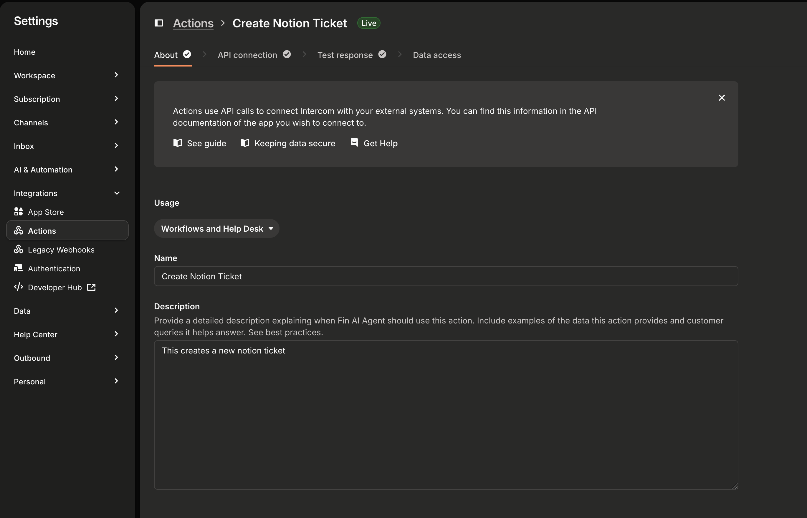
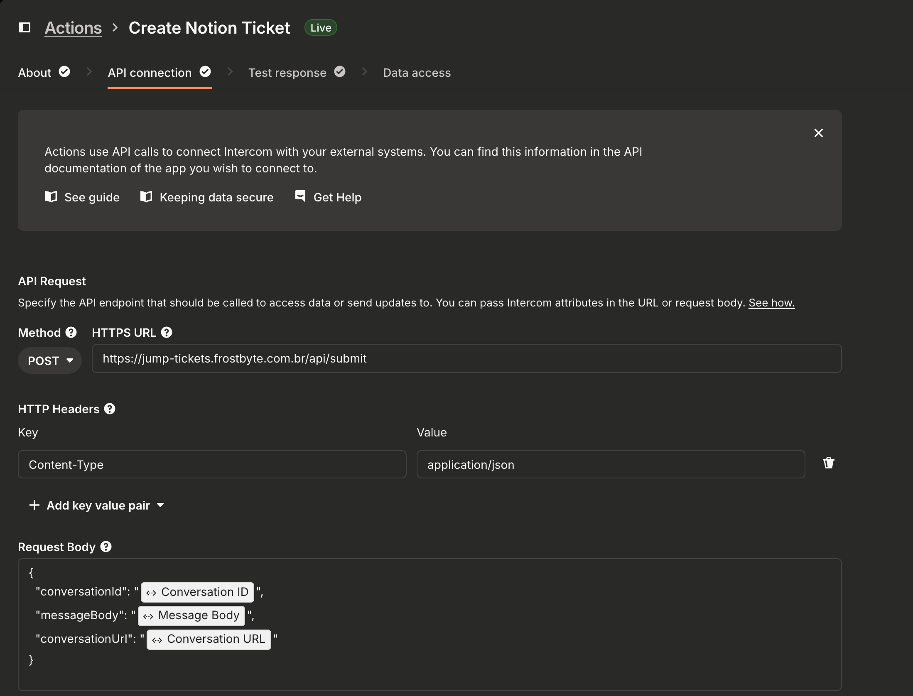
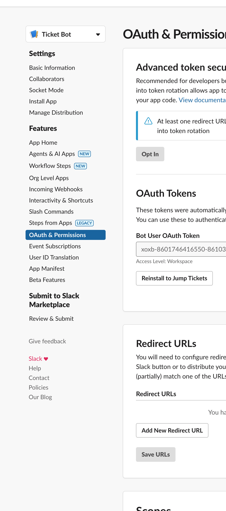

# JumpTickets

## Integration Logic

Sample request

```elixir
%JumpTickets.IntegrationRequest.Request{
  id: nil,
  intercom_conversation_id: "2",
  intercom_conversation_url: "https://new-test.example.com",
  message_body: "What is happening?",
  status: :completed,
  steps: %{
    check_existing_tickets: %JumpTickets.IntegrationRequest.Step{
      type: :check_existing_tickets,
      status: :completed,
      started_at: ~U[2025-03-16 18:16:13.845786Z],
      completed_at: ~U[2025-03-16 18:16:14.641125Z],
      error: nil,
      result: [
        %JumpTickets.Ticket{
          __meta__: #Ecto.Schema.Metadata<:built, "tickets">,
          id: nil,
          notion_id: "1b8d3c1b-90d3-81ab-abae-f453c9ef24cc",
          notion_url: "https://www.notion.so/Test-Conversation-WhatsApp-Channel-Setup-Demonstration-1b8d3c1b90d381ababaef453c9ef24cc",
          ticket_id: "JMP-29",
          title: "Test Conversation - WhatsApp Channel Setup Demonstration",
          intercom_conversations: "https://test.com",
          summary: nil,
          slack_channel: "https://app.slack.com/client/T08HPMYC8G6/C08J8FYMNQH?entry_point=nav_menu"
        }
      ]
    },
    ai_analysis: %JumpTickets.IntegrationRequest.Step{
      type: :ai_analysis,
      status: :completed,
      started_at: ~U[2025-03-16 18:16:14.641136Z],
      completed_at: ~U[2025-03-16 18:16:21.214706Z],
      error: nil,
      result: {:existing,
       %JumpTickets.Ticket{
         __meta__: #Ecto.Schema.Metadata<:built, "tickets">,
         id: nil,
         notion_id: "1b8d3c1b-90d3-81ab-abae-f453c9ef24cc",
         notion_url: "https://www.notion.so/Test-Conversation-WhatsApp-Channel-Setup-Demonstration-1b8d3c1b90d381ababaef453c9ef24cc",
         ticket_id: "JMP-29",
         title: "Test Conversation - WhatsApp Channel Setup Demonstration",
         intercom_conversations: "https://test.com",
         summary: nil,
         slack_channel: "https://app.slack.com/client/T08HPMYC8G6/C08J8FYMNQH?entry_point=nav_menu"
       }}
    },
    create_or_update_notion_ticket: %JumpTickets.IntegrationRequest.Step{
      type: :create_or_update_notion_ticket,
      status: :completed,
      started_at: ~U[2025-03-16 19:37:43.331492Z],
      completed_at: ~U[2025-03-16 19:37:44.668251Z],
      error: nil,
      result: %JumpTickets.Ticket{
        __meta__: #Ecto.Schema.Metadata<:built, "tickets">,
        id: nil,
        notion_id: "1b8d3c1b-90d3-81ab-abae-f453c9ef24cc",
        notion_url: "https://www.notion.so/Test-Conversation-WhatsApp-Channel-Setup-Demonstration-1b8d3c1b90d381ababaef453c9ef24cc",
        ticket_id: "JMP-29",
        title: "Test Conversation - WhatsApp Channel Setup Demonstration",
        intercom_conversations: "https://new-test.example.com,https://test.com",
        summary: nil,
        slack_channel: "https://app.slack.com/client/T08HPMYC8G6/C08J8FYMNQH?entry_point=nav_menu"
      }
    },
    maybe_create_slack_channel: %JumpTickets.IntegrationRequest.Step{
      type: :maybe_create_slack_channel,
      status: :completed,
      started_at: ~U[2025-03-16 19:37:44.668263Z],
      completed_at: ~U[2025-03-16 19:37:44.668287Z],
      error: nil,
      result: %{
        url: "https://app.slack.com/client/T08HPMYC8G6/C08J8FYMNQH?entry_point=nav_menu",
        channel_id: "C08J8FYMNQH"
      }
    },
    maybe_update_notion_with_slack: %JumpTickets.IntegrationRequest.Step{
      type: :maybe_update_notion_with_slack,
      status: :completed,
      started_at: ~U[2025-03-16 19:37:44.668292Z],
      completed_at: ~U[2025-03-16 19:37:45.421927Z],
      error: nil,
      result: %JumpTickets.Ticket{
        __meta__: #Ecto.Schema.Metadata<:built, "tickets">,
        id: nil,
        notion_id: "1b8d3c1b-90d3-81ab-abae-f453c9ef24cc",
        notion_url: "https://www.notion.so/Test-Conversation-WhatsApp-Channel-Setup-Demonstration-1b8d3c1b90d381ababaef453c9ef24cc",
        ticket_id: "JMP-29",
        title: "Test Conversation - WhatsApp Channel Setup Demonstration",
        intercom_conversations: "https://new-test.example.com,https://test.com",
        summary: nil,
        slack_channel: "https://app.slack.com/client/T08HPMYC8G6/C08J8FYMNQH?entry_point=nav_menu"
      }
    },
    add_intercom_users_to_slack: %JumpTickets.IntegrationRequest.Step{
      type: :add_intercom_users_to_slack,
      status: :completed,
      started_at: ~U[2025-03-16 19:37:45.421939Z],
      completed_at: ~U[2025-03-16 19:37:47.775819Z],
      error: nil,
      result: nil
    }
  },
  created_at: ~U[2025-03-16 18:16:13.845205Z],
  updated_at: ~U[2025-03-16 19:37:47.775832Z],
  context: %{}
}
```

## Setup Intercom

- Setup `INTERCOM_SECRET` by creating Intercom App from developer hub and grabbing the secret key, don't forget to add the app to the workspace
- From the intercom inbox ui go to Settings > Integrations > Actions > Create new Action
- In usage select Workflows and Help Desk
- In API Connection set it do a post request to the deployed app at /api/submit and include the headers and request body from the screenshot.
- With these settings you can click "save and set live"
  
  

## Setup Anthropic

- Right now the project uses Claude-3.5-haiku for deciding between existing tickets, set the API key `CLAUDE_SECRET`

## Setup notion

- Create a new integration
- Grab the secret key and set `NOTION_SECRET`
- Add the integration to the db file
- Grab db id and set `NOTION_DB_ID`

## Setup Slack

- Create slack app and navigate to OAuth and Permissions
- Set the following oauth scopes and generate token

  ```
  channels:manage
  channels:read
  channels:write.invites
  chat:write
  users:read
  users:read.email
  ```

- Set `SLACK_BOT_TOKEN` with the value from the previous step
  

## Deploy

- Copy .env.template to .env
- Set `PHX_HOST` to the url the base app is hosted on
- Set `SECRET_KEY_BASE` to the result of `mix phx.gen.secret`
- Set `MIX_ENV` to "prod"
  ```
    $ source .env
    $ mix deps.get
    $ mix assets.deploy
    $ mix release
    $  _build/prod/rel/jump_tickets/bin/jump_tickets start
  ```

## Learn more

- Official website: https://www.phoenixframework.org/
- Guides: https://hexdocs.pm/phoenix/overview.html
- Docs: https://hexdocs.pm/phoenix
- Forum: https://elixirforum.com/c/phoenix-forum
- Source: https://github.com/phoenixframework/phoenix
